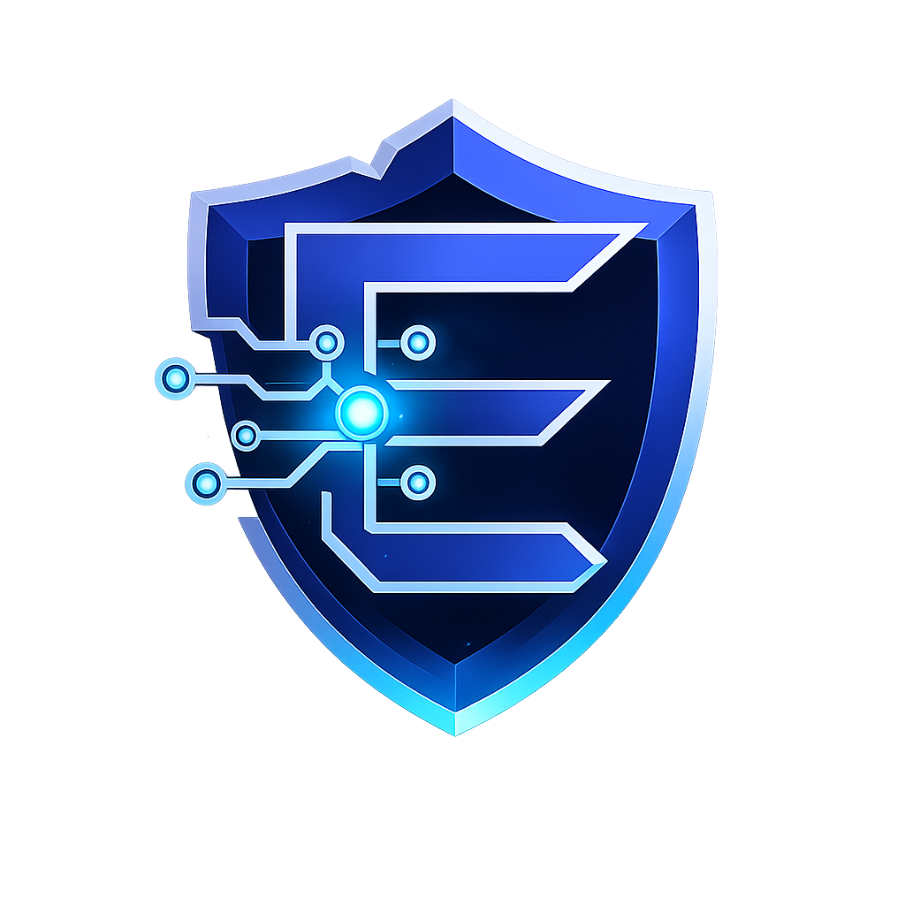

<div align="center">



# `AYMAN ALHASHEMI`

### Cybersecurity Expert · Digital Forensics Specialist · Software Engineer


<br>


</div>

---

<div align="center">

## `01` ABOUT ME

</div>

<table>
<tr>
<td width="58%" valign="top">

### Hello, I'm Ayman

I am a **Cybersecurity Expert** and **Digital Forensics Specialist** focused on protecting digital environments, investigating incidents, and building powerful technology.

I develop **applications, operating systems, games, software tools, and complete computer solutions** with security, performance, and practical value at the core.

```yaml
name: Ayman Alhashemi
role: Cybersecurity & Digital Forensics Expert
company: E-hax
operating_system: E-hax OS
vision: Secure technology built for real-world impact
```

</td>
<td width="42%" valign="top" dir="rtl">

### مرحبًا، أنا أيمن

خبير في **أمن المعلومات** ومتخصص في **التحقيق الجنائي الرقمي**، أعمل على حماية البيئات الرقمية وتحليل الحوادث والأدلة الإلكترونية.

أطور **التطبيقات والأنظمة والألعاب والبرامج**، وأقدم حلولًا وخدمات تقنية متكاملة للحاسوب.

مؤسس **شركة E-hax** ومبتكر **نظام E-hax OS**.

</td>
</tr>
</table>

---

<div align="center">

## `02` CORE EXPERTISE

<table>
<tr>
<td align="center" width="25%">
<br><br>
<b>Cybersecurity</b><br>
<sub>Information protection<br>Threat analysis<br>Secure architecture</sub>
</td>
<td align="center" width="25%">
<br><br>
<b>Digital Forensics</b><br>
<sub>Evidence analysis<br>Incident investigation<br>Forensic examination</sub>
</td>
<td align="center" width="25%">
<br><br>
<b>Software Engineering</b><br>
<sub>Web and desktop<br>Mobile applications<br>Software tools</sub>
</td>
<td align="center" width="25%">
<br><br>
<b>Systems & Games</b><br>
<sub>Operating systems<br>Game development<br>Computer solutions</sub>
</td>
</tr>
</table>

</div>

---

<div align="center">

## `03` TECHNOLOGY STACK

### Languages · Frameworks · Databases


<br><br>


### Engines · Editors · Platforms


<br><br>


</div>

---

<div align="center">

## `04` E-HAX ECOSYSTEM

</div>

<table>
<tr>
<td align="center" width="50%" valign="top">

### 🛡️ E-hax Company


A technology company specializing in cybersecurity, digital forensics, software development, systems, games, and complete computer services.

`SECURITY` · `SOFTWARE` · `SYSTEMS` · `INNOVATION`

</td>
<td align="center" width="50%" valign="top">

### 💻 E-hax OS


A specialized operating system designed around security, performance, digital investigation, development, and practical technical work.

`SECURE` · `POWERFUL` · `PRACTICAL` · `MODERN`

</td>
</tr>
</table>

---

<div align="center">

## `05` WHAT I BUILD


<br><br>

```text
┌──────────────────────────────────────────────────────────────┐
│  SECURITY FIRST  ·  PERFORMANCE DRIVEN  ·  BUILT TO MATTER  │
└──────────────────────────────────────────────────────────────┘
```

### Secure by design. Built with purpose. Driven by innovation.

<sub>© Ayman Alhashemi · Founder of E-hax · Creator of E-hax OS</sub>

</div>
